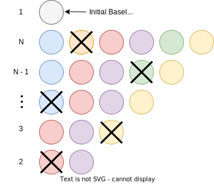
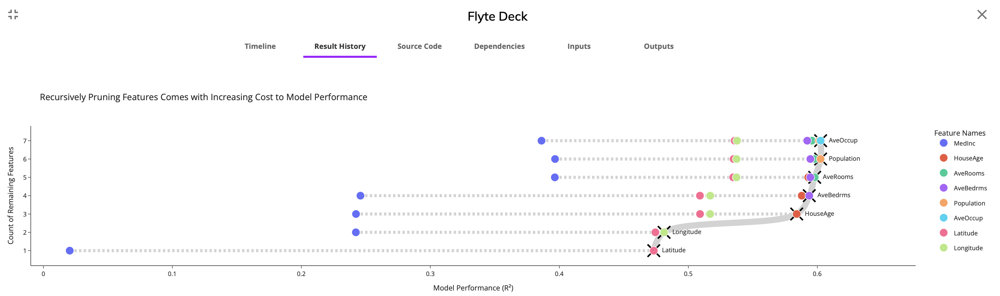

# Serverless Workflow Orchestration

During my nearly three years at Capital One, I was a strong proponent of Workflow Orchestration and championed [Kubeflow Pipelines](https://www.kubeflow.org/docs/components/pipelines/v2/) (KFP). I aided many teams in exploring workflow orchestration, consulted with nearly a hundred individuals, and pioneered best practices.

All the same, I found myself feeling quite limited by KFP's strict and non-intuitive implementation. Over the last six months, I have reimagined my entire ML engineering philosophy around [Flyte](https://docs.flyte.org/en/latest/index.html), a modern, open-source, pythonic workflow orchestrator.

However, as an independent AI researcher, I do not have access to the reliable, scalable Kubernetes infrastructure that enables large organizations. I do not have the expertise to manage my own Kubernetes cluster with accelerated hardware.

When I first began my independent work, I was able to leverage the many benefits of Flyte while still executing my projects on my local homelab. However, as my work grew in complexity and required greater scalability, I began to outgrow my local machine.

A few months ago, [Union](https://www.union.ai), the developers behind Flyte, reached out with the opportunity to experiment with their Union Serverless Offering. Just as it sounds, Union Serverless provides individuals and small organizations access to a managed Kubernetes cluster to execute their workflows. Being "serverless", users only pay for the resources they actively use without compromising scale or complexity.

## Workflow Orchestration

Before discussing my experience with Union Serverless, I would like to establish some basic terminology and background on the state of workflow orchestration.

Workflow orchestration is an ML Engineering / MLOps framework to structure data science projects.

Workflow orchestration attempts to isolate the individual steps required to accomplish a larger body of work into a _"task"_. Tasks are authored with high-level code, and may have any number of inputs and outputs. Each task may have its own unique runtime environment defined by, for example, a specified version of Python and a list of Python libraries. An environment is also defined by its hardware requirements, such as compute (some amount of memory and CPU cores) as well as accelerated hardware (some number of GPUs).

The ability for tasks to be authored in heterogeneous environments is a significant advantage of workflow orchestration. Suppose you have some model training workflow that requires a data collection phase (executing a Snowflow query), a feature engineering phase (distributed compute with Spark), and a model training phase (PyTorch with a high-end GPU). Without workflow orchestration, these conflicting environment requirements would be unpleasant to manage. Additionally, workflow orchestration allows for parallelized task execution and task caching.

Tasks may be _orchestrated_ together to create a _"workflow"_. Workflows represent a larger body of work. Workflows are defined by tasks and even other workflows, such that you may embed workflows within workflows.

Flyte, being a modern take on workflow orchestration, takes the idea a bit further than other workflow orchestration engines with the following polished features:
1. [Dynamic workflows](https://docs.flyte.org/projects/cookbook/en/v0.3.66/auto/core/control_flow/dynamics.html) to support dynamic iteration and recursion.
2. [Task parallelism](https://docs.flyte.org/en/latest/user_guide/advanced_composition/map_tasks.html) to run the same task in parallel with varying inputs among multiple instances and collect their outputs in a subsequent task.
3. [Agents](https://docs.flyte.org/en/latest/flyte_agents/index.html) to manage asynchronous operations, such as long-running queries or a model deployment.
4. [Artifact](https://docs.flyte.org/en/latest/api/flytekit/generated/flytekit.Artifact.html) management and querying.

This is just scratching the surface of Flyte's capabilities as an orchestration engine, however, their [strong documentation](https://docs.flyte.org/en/latest/index.html) does a better job of highlighting the library's sophistication than I possibly could.

A common pattern in traditional machine learning is the process of iteratively pruning tabular features from a model to reduce its complexity. An ideal traditional machine learning model should be as simple as possible while still achieving its desired outcomes. By removing unnecessary features, a model developer can potentially improve generalizability and long-term stability, reduce inference costs and reduce model inference latency.

However, iterative feature pruning is hard to optimize effectively. It requires that the model developer train a larger number of models to test how much each feature contributes. Instead of training a large number of models sequentially, we can utilize workflow orchestration to parallelize the training of many models.

I have defined the following logic to iteratively prune features from a tabular model:
1. Train a model with all of the features present to establish a baseline
2. For each feature used to train the original model, remove that feature and train a new model
3. Identify the feature that, when removed, results in the smallest decrease in model performance as the "least important feature"
4. Permanently remove the "least important feature" from the current baseline to establish a new baseline
5. Repeat the previous steps until there is only one feature remaining

If one were to execute this algorithm sequentially, it would require the following time complexity equal to the number of features: $\dfrac{N(N+1)}{2}$, which simplifies to $O(N^2)$

However, if we could parallelize the second step (training a model for each remaining feature, having removed that feature), we could effectively simplify the time complexity to $O(N)$.



This operation is particularly complex, however. We may implement it in Flyte with a recursive loop using Flyte's `flytekit.dynamic` decorator. Within each recursion, we utilize task parallelism (`flytekit.map_task`). As the name suggests, dynamic workflows have an undetermined DAG at workflow compilation time and will be constructed during runtime.

```python
import dataclasses
from functools import partial

import flytekit
from mashumaro.mixins.json import DataClassJSONMixin

# Flyte likes to use dataclasses to pass around complex objects
# Flyte will handle the serialization / deserialization of these objects for you!
@dataclasses.dataclass
class Result(DataClassJSONMixin):
    
    """Serializable model result
    """
    
    name: str # feature that was removed to create the model
    value: float # the performance of the model

@dataclasses.dataclass
class ResultHistory(DataClassJSONMixin):
    
    """Serializable collection of model pruning iteration results
    """
    
    results: list[list[Result]]
    
    @classmethod
    def new(cls) -> "ResultHistory":
        
        return cls(results=[])
    
@flytekit.task
def train(
    features: list[str],
    dataset: flytekit.types.file.FlyteFile,
    remove: str
) -> Result:
    ...
    
    # read a dataset, select available features
    # train a model with `features`, excluding `remove`
    # return a `Result` with the name of the removed feature and the model performance
    
@flytekit.task
def prune(results: list[Result]) -> list[str]:
    ...
    
    # find the least important feature
    # return all features except for least important feature
    
@flytekit.task
def append(history: ResultHistory, results: list[Result]) -> ResultHistory:
    ...
    
    # append the latest recursion of results to the result history and return it


@flytekit.dynamic
def recursively_prune_features(
    depth: int,
    features: list[str],
    dataset: flytekit.types.file.FlyteFile,
) -> ResultHistory:
    
    # the requested recursion depth should never be larger than the number of available features
    assert depth < len(features)
    
    # create new result history before starting recursion
    history = ResultHistory.new()
    
    # begin recursing over features, iteratively pruning the least important ones
    for _ in range(depth):
        
        # train multiple models in parallel
        trainer = partial(train, features=features, dataset=dataset)
        results = flytekit.map_task(trainer)(remove=features)
        
        # identify least important feature
        features = prune(results=results)

        # save recursion results
        history = append(history=history, results=results)
    
    return history
```

I am blown away by the elegance of Flyte's SDK. It feels so natural and intuitive that I was able to create this basic workflow in my first attempt! Including all utility functions, documentation, and plotting functions, this parallelized, cached, dynamic workflow took only 300 lines of Python to construct. My source code is available here.

After removing all but the last remaining feature, we may plot the history to find the relative feature importance for each recursion and the marginal impact on model performance regardless of whether the model used is a "black box". Flyte provides the ability to render static `html` directly to their web UI. For the following visualization, I render a Plotly figure and save its underlying `html` to a Flyte Deck.



I used the [California Housing dataset](https://www.kaggle.com/datasets/camnugent/california-housing-prices) to train a simple linear regression model without any feature engineering. The plot visualizes the model performance (R²) as a function of removing any one of the remaining features for an iteration until all but one feature has been removed.

As the plot above illustrates, the feature `MedInc` (Median Income) is the most important feature because removing it results in the worst model among every recursion. Additionally, `Latitude` and `Longitude` and also of great value to the model. The other features are not nearly as important as these three.

Among more complex business problems with significantly larger data, training $\dfrac{100^2}{2}$ model variations does come with a price, but that price is same whether the models are trained in parallel or sequentially. For some modeling problems at scale, limiting the number of features to the absolute minimum while maintaining optimal performance is paramount.

## My experience with Union Serverless

The problem is fun, and I would argue it makes for a very practical "hello world" for workflow orchestration. However, I have seen many practicing model developers struggle to implement such an analysis simply because of the limitations of their infrastructure combined with a larger number of candidate features (100+). However, by using workflow orchestration to manage the execution of your work, implementing this becomes quite trivial.

However, Union Serverless allows individuals such as myself, as well as small teams, to utilize advanced infrastructure without having to dig deep into Docker or Kubernetes. While I do personally think it is valuable for data scientists to be familiar with Docker and Kubernetes, FlyteKit effectively abstracts away all of their complexities such that it is not required. I did not have to bother with configuring a Kubernetes cluster, creating an account for a cloud provider (AWS, GCP, Azure), or providing any configuration or settings - Union Serverless works right out of the box. I did not have to install Docker or build any images. Union Serverless builds my images for me in the cloud without any hassle. I did not have to import my local libraries/scripts - FlyteKit will automatically handle my local scripts behind the scenes.

On the same note, it took me less than three minutes to onboard to Union Serverless. I was able to authenticate using integration with GitHub. There is no "password" or SSH token required.

As for my model development experience, I effectively trained hundreds of models with the press of a button in arbitrarily complex environments (including GPUs and high-memory instances). I can conveniently execute pipelines and manage secrets and artifacts with a local command line interface (`unionai`). I am able "author" FlyteKit tasks from the comfort of my preferred IDE on my local machine. I was also surprised by how quickly my tasks were provisioned. I am not waiting minutes for a task to start (as I had experienced with KFP) - my tasks typically provision in mere seconds.

In general Union Serverless makes for a very compelling offering for small teams of or individual data scientists, analysts, or engineers who want to get stuff done quickly and reliably without having to bother with cloud providers, managing their cluster, storage, secrets, authentication, and images. It feels quite magical.